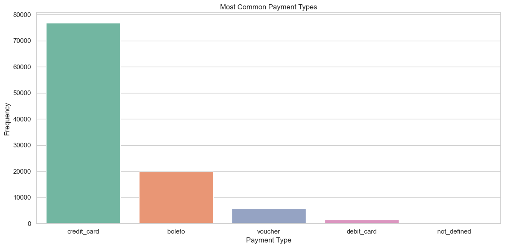
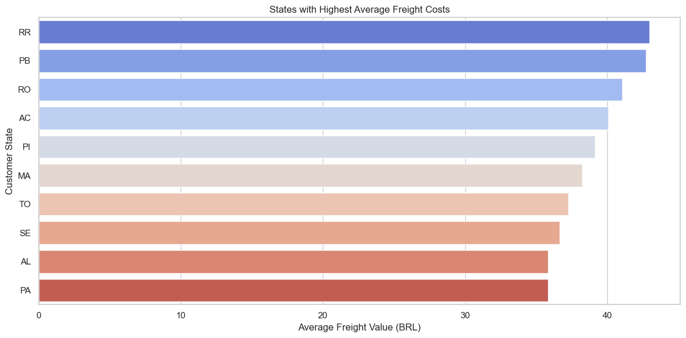
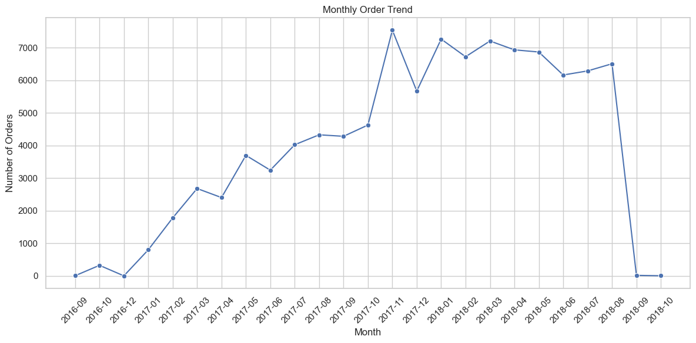
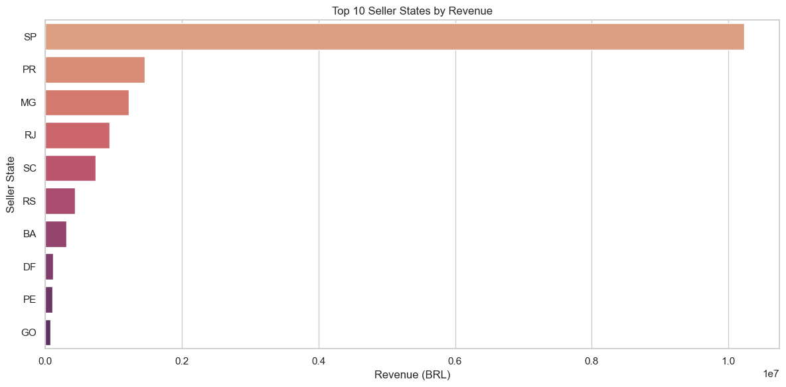

```python
import sqlite3
import pandas as pd

db_path = r'C:\Users\User\Downloads\Anaconda\E-commerce olist (SQL)\olist.sqlite'
conn = sqlite3.connect(db_path)

query = """
SELECT 
    pct.product_category_name_english AS category,
    COUNT(oi.order_id) AS total_sales
FROM order_items oi
JOIN products p ON oi.product_id = p.product_id
JOIN product_category_name_translation pct ON p.product_category_name = pct.product_category_name
GROUP BY pct.product_category_name_english
ORDER BY total_sales DESC
LIMIT 10;
"""

df = pd.read_sql_query(query, conn)
print(df)

```

                    category  total_sales
    0         bed_bath_table        11115
    1          health_beauty         9670
    2         sports_leisure         8641
    3        furniture_decor         8334
    4  computers_accessories         7827
    5             housewares         6964
    6          watches_gifts         5991
    7              telephony         4545
    8           garden_tools         4347
    9                   auto         4235
    


```python
import sqlite3
import pandas as pd

db_path = r'C:\Users\User\Downloads\Anaconda\E-commerce olist (SQL)\olist.sqlite'
conn = sqlite3.connect(db_path)

query = """
SELECT 
    customer_state,
    COUNT(customer_id) AS total_customers
FROM customers
GROUP BY customer_state
ORDER BY total_customers DESC
LIMIT 5;

"""

df = pd.read_sql_query(query, conn)
print(df)

```

      customer_state  total_customers
    0             SP            41746
    1             RJ            12852
    2             MG            11635
    3             RS             5466
    4             PR             5045
    


```python
import sqlite3
import pandas as pd

db_path = r'C:\Users\User\Downloads\Anaconda\E-commerce olist (SQL)\olist.sqlite'
conn = sqlite3.connect(db_path)

query = """
SELECT 
    pct.product_category_name_english AS category,
    ROUND(SUM(oi.price + oi.freight_value), 2) AS total_revenue
FROM order_items oi
JOIN products p ON oi.product_id = p.product_id
JOIN product_category_name_translation pct ON p.product_category_name = pct.product_category_name
GROUP BY pct.product_category_name_english
ORDER BY total_revenue DESC
LIMIT 10;

"""

df = pd.read_sql_query(query, conn)
print(df)

```

                    category  total_revenue
    0          health_beauty     1441248.07
    1          watches_gifts     1305541.61
    2         bed_bath_table     1241681.72
    3         sports_leisure     1156656.48
    4  computers_accessories     1059272.40
    5        furniture_decor      902511.79
    6             housewares      778397.77
    7             cool_stuff      719329.95
    8                   auto      685384.32
    9           garden_tools      584219.21
    


```python
import sqlite3
import pandas as pd

db_path = r'C:\Users\User\Downloads\Anaconda\E-commerce olist (SQL)\olist.sqlite'
conn = sqlite3.connect(db_path)

query = """
SELECT 
    pct.product_category_name_english AS category,
    ROUND(AVG(orv.review_score), 2) AS avg_score
FROM order_reviews orv
JOIN order_items oi ON orv.order_id = oi.order_id
JOIN products p ON oi.product_id = p.product_id
JOIN product_category_name_translation pct ON p.product_category_name = pct.product_category_name
GROUP BY pct.product_category_name_english
HAVING COUNT(orv.review_id) > 50
ORDER BY avg_score DESC
LIMIT 10;

"""

df = pd.read_sql_query(query, conn)
print(df)

```

                                    category  avg_score
    0                 books_general_interest       4.45
    1                costruction_tools_tools       4.44
    2                         books_imported       4.40
    3                        books_technical       4.37
    4                    luggage_accessories       4.32
    5                             food_drink       4.32
    6  small_appliances_home_oven_and_coffee       4.30
    7                          fashion_shoes       4.23
    8                                   food       4.22
    9                             cine_photo       4.21
    


```python
 import sqlite3
import pandas as pd

db_path = r'C:\Users\User\Downloads\Anaconda\E-commerce olist (SQL)\olist.sqlite'
conn = sqlite3.connect(db_path)

query = """
SELECT 
    ROUND(AVG(JULIANDAY(order_delivered_customer_date) - JULIANDAY(order_purchase_timestamp)), 2) AS avg_delivery_days
FROM orders
WHERE order_delivered_customer_date IS NOT NULL;

"""

df = pd.read_sql_query(query, conn)
print(df)

```

       avg_delivery_days
    0              12.56
    


```python
 import sqlite3
import pandas as pd

db_path = r'C:\Users\User\Downloads\Anaconda\E-commerce olist (SQL)\olist.sqlite'
conn = sqlite3.connect(db_path)

query = """
SELECT 
    s.seller_id,
    ROUND(SUM(oi.price + oi.freight_value), 2) AS total_revenue
FROM order_items oi
JOIN sellers s ON oi.seller_id = s.seller_id
GROUP BY s.seller_id
ORDER BY total_revenue DESC
LIMIT 10;

"""

df = pd.read_sql_query(query, conn)
print(df)

```

                              seller_id  total_revenue
    0  4869f7a5dfa277a7dca6462dcf3b52b2      249640.70
    1  7c67e1448b00f6e969d365cea6b010ab      239536.44
    2  53243585a1d6dc2643021fd1853d8905      235856.68
    3  4a3ca9315b744ce9f8e9374361493884      235539.96
    4  fa1c13f2614d7b5c4749cbc52fecda94      204084.73
    5  da8622b14eb17ae2831f4ac5b9dab84a      185192.32
    6  7e93a43ef30c4f03f38b393420bc753a      182754.05
    7  1025f0e2d44d7041d6cf58b6550e0bfa      172860.69
    8  7a67c85e85bb2ce8582c35f2203ad736      162648.38
    9  955fee9216a65b617aa5c0531780ce60      160602.68
    


```python
 import sqlite3
import pandas as pd

db_path = r'C:\Users\User\Downloads\Anaconda\E-commerce olist (SQL)\olist.sqlite'
conn = sqlite3.connect(db_path)

query = """
SELECT 
    payment_type,
    COUNT(*) AS frequency
FROM order_payments
GROUP BY payment_type
ORDER BY frequency DESC;

"""

df = pd.read_sql_query(query, conn)
print(df)

```

      payment_type  frequency
    0  credit_card      76795
    1       boleto      19784
    2      voucher       5775
    3   debit_card       1529
    4  not_defined          3
    


```python
 import sqlite3
import pandas as pd

db_path = r'C:\Users\User\Downloads\Anaconda\E-commerce olist (SQL)\olist.sqlite'
conn = sqlite3.connect(db_path)

query = """
SELECT 
    order_status,
    COUNT(order_id) AS total_orders
FROM orders
GROUP BY order_status
ORDER BY total_orders DESC;

"""

df = pd.read_sql_query(query, conn)
print(df)

```

      order_status  total_orders
    0    delivered         96478
    1      shipped          1107
    2     canceled           625
    3  unavailable           609
    4     invoiced           314
    5   processing           301
    6      created             5
    7     approved             2
    


```python
 import sqlite3
import pandas as pd

db_path = r'C:\Users\User\Downloads\Anaconda\E-commerce olist (SQL)\olist.sqlite'
conn = sqlite3.connect(db_path)

query = """
SELECT 
    c.customer_state,
    ROUND(AVG(oi.freight_value), 2) AS avg_freight
FROM order_items oi
JOIN orders o ON oi.order_id = o.order_id
JOIN customers c ON o.customer_id = c.customer_id
GROUP BY c.customer_state
ORDER BY avg_freight DESC
LIMIT 5;

"""

df = pd.read_sql_query(query, conn)
print(df)

```

      customer_state  avg_freight
    0             RR        42.98
    1             PB        42.72
    2             RO        41.07
    3             AC        40.07
    4             PI        39.15
    


```python
 import sqlite3
import pandas as pd
import matplotlib.pyplot as plt
import seaborn as sns
import warnings 


%matplotlib inline
sns.set(style="whitegrid")
plt.rcParams["figure.figsize"] = (12, 6)


db_path = r'C:\Users\User\Downloads\Anaconda\E-commerce olist (SQL)\olist.sqlite'
conn = sqlite3.connect(db_path)

```


```python
query = """
SELECT 
    pct.product_category_name_english AS category,
    COUNT(oi.order_id) AS total_sales
FROM order_items oi
JOIN products p ON oi.product_id = p.product_id
JOIN product_category_name_translation pct ON p.product_category_name = pct.product_category_name
GROUP BY pct.product_category_name_english
ORDER BY total_sales DESC
LIMIT 10;
"""

df_sales = pd.read_sql_query(query, conn)

warnings.filterwarnings("ignore", category=FutureWarning)
sns.barplot(x="total_sales", y="category", data=df_sales, palette="viridis")
plt.title("Top 10 Best-Selling Product Categories")
plt.xlabel("Total Sales")
plt.ylabel("Category")
plt.tight_layout()
plt.show()

```


    

    


```python
query = """
SELECT 
    pct.product_category_name_english AS category,
    ROUND(SUM(oi.price + oi.freight_value), 2) AS total_revenue
FROM order_items oi
JOIN products p ON oi.product_id = p.product_id
JOIN product_category_name_translation pct ON p.product_category_name = pct.product_category_name
GROUP BY pct.product_category_name_english
ORDER BY total_revenue DESC
LIMIT 10;
"""

df_revenue = pd.read_sql_query(query, conn)

warnings.filterwarnings("ignore", category=FutureWarning)
sns.barplot(x="total_revenue", y="category", data=df_revenue, palette="crest")
plt.title("Top 10 Product Categories by Revenue")
plt.xlabel("Revenue (BRL)")
plt.ylabel("Category")
plt.tight_layout()
plt.show()

```


    

    


```python
query = """
SELECT 
    order_status,
    COUNT(order_id) AS total_orders
FROM orders
GROUP BY order_status
ORDER BY total_orders DESC;
"""

df_status = pd.read_sql_query(query, conn)

warnings.filterwarnings("ignore", category=FutureWarning)
sns.barplot(x="total_orders", y="order_status", data=df_status, palette="mako")
plt.title("Order Status Distribution")
plt.xlabel("Number of Orders")
plt.ylabel("Order Status")
plt.tight_layout()
plt.show()

```


    

    


```python
query = """
SELECT 
    review_score,
    COUNT(*) AS count
FROM order_reviews
GROUP BY review_score
ORDER BY review_score;
"""

df_reviews = pd.read_sql_query(query, conn)
warnings.filterwarnings("ignore", category=FutureWarning)
sns.barplot(x="review_score", y="count", data=df_reviews, palette="rocket")
plt.title("Distribution of Review Scores")
plt.xlabel("Review Score")
plt.ylabel("Number of Reviews")
plt.tight_layout()
plt.show()

```


    

    


```python
query = """
SELECT 
    payment_type,
    COUNT(*) AS frequency
FROM order_payments
GROUP BY payment_type
ORDER BY frequency DESC;
"""

df_payments = pd.read_sql_query(query, conn)
warnings.filterwarnings("ignore", category=FutureWarning)
sns.barplot(x="payment_type", y="frequency", data=df_payments, palette="Set2")
plt.title("Most Common Payment Types")
plt.xlabel("Payment Type")
plt.ylabel("Frequency")
plt.tight_layout()
plt.show()

```


    

    


```python
query = """
SELECT 
    c.customer_state,
    ROUND(AVG(oi.freight_value), 2) AS avg_freight
FROM order_items oi
JOIN orders o ON oi.order_id = o.order_id
JOIN customers c ON o.customer_id = c.customer_id
GROUP BY c.customer_state
HAVING COUNT(*) > 50
ORDER BY avg_freight DESC
LIMIT 10;
"""

df_freight = pd.read_sql_query(query, conn)
warnings.filterwarnings("ignore", category=FutureWarning)
sns.barplot(x="avg_freight", y="customer_state", data=df_freight, palette="coolwarm")
plt.title("States with Highest Average Freight Costs")
plt.xlabel("Average Freight Value (BRL)")
plt.ylabel("Customer State")
plt.tight_layout()
plt.show()

```


    

    


```python
query = """
SELECT 
    strftime('%Y-%m', order_purchase_timestamp) AS month,
    COUNT(*) AS total_orders
FROM orders
GROUP BY month
ORDER BY month;
"""

df_monthly = pd.read_sql_query(query, conn)

sns.lineplot(x="month", y="total_orders", data=df_monthly, marker="o")
plt.xticks(rotation=45)
plt.title("Monthly Order Trend")
plt.xlabel("Month")
plt.ylabel("Number of Orders")
plt.tight_layout()
plt.show()

```


    

    


```python
query = """
SELECT 
    s.seller_state,
    ROUND(SUM(oi.price + oi.freight_value), 2) AS total_revenue
FROM order_items oi
JOIN sellers s ON oi.seller_id = s.seller_id
GROUP BY s.seller_state
ORDER BY total_revenue DESC
LIMIT 10;
"""

df_seller_rev = pd.read_sql_query(query, conn)
warnings.filterwarnings("ignore", category=FutureWarning)
sns.barplot(x="total_revenue", y="seller_state", data=df_seller_rev, palette="flare")
plt.title("Top 10 Seller States by Revenue")
plt.xlabel("Revenue (BRL)")
plt.ylabel("Seller State")
plt.tight_layout()
plt.show()

```


    

    

